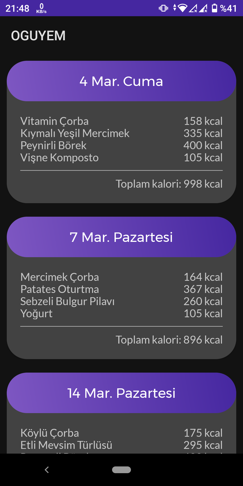
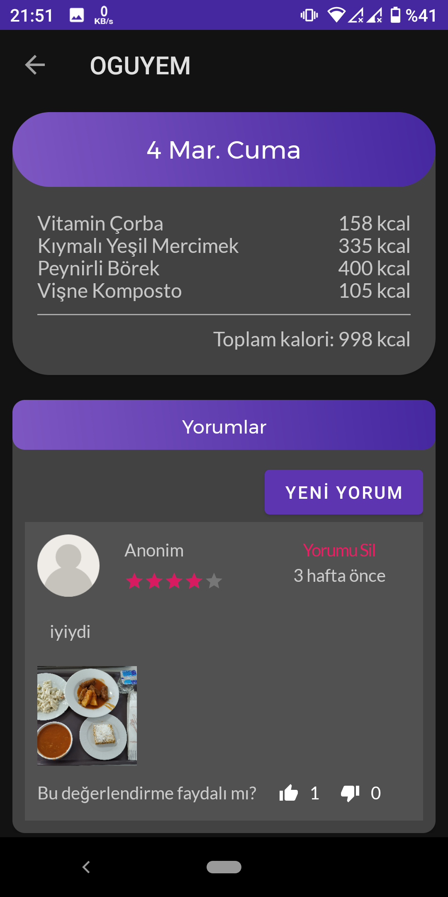

# OGUYEM

OGUYEM is a simple application that displays the menu for [OGU][ogurefectory]'s refectory.

Users can view the menu, vote for menu, add comments, add pictures to the comment and view the comments.

## Screenshots

    
    
    

> **Note:** This application is not associated with [OGU][ogurefectory] in any way. And it is used for learning purposes only.

[ogurefectory]: https://yemekhane.ogu.edu.tr
    "OGU's refectory menu page"
